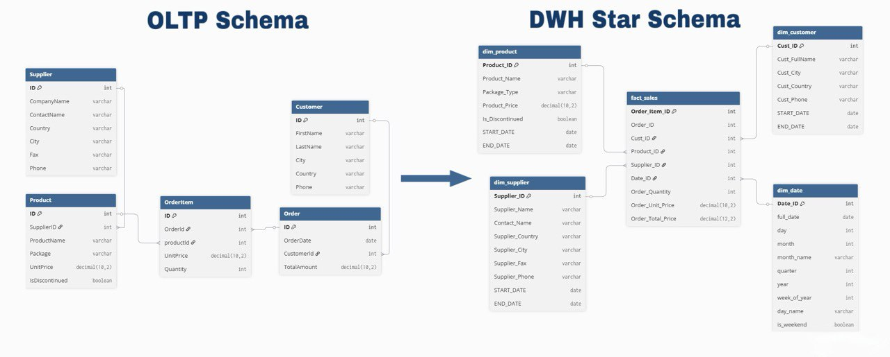
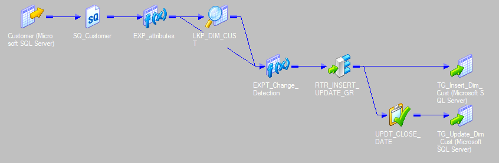
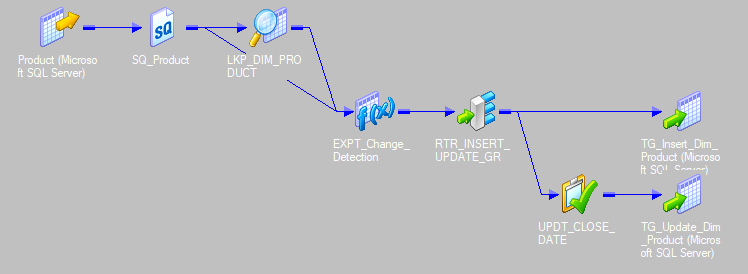
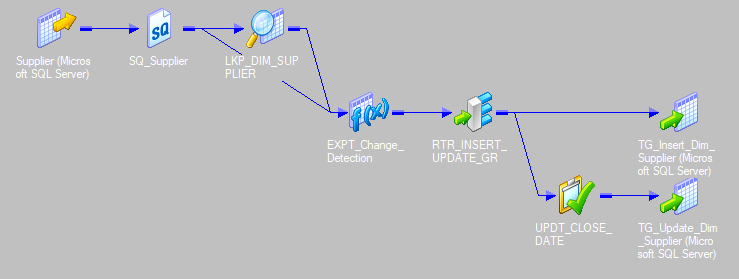
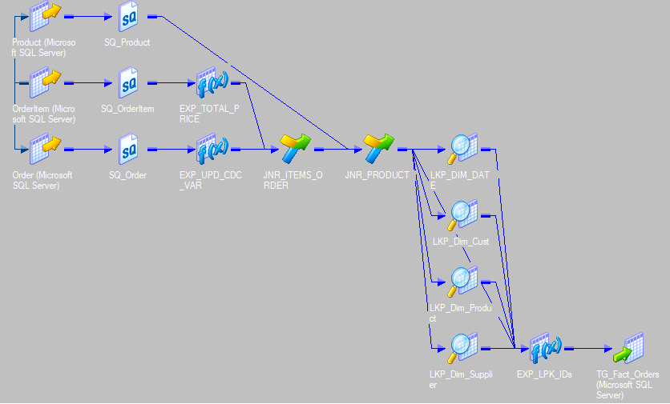
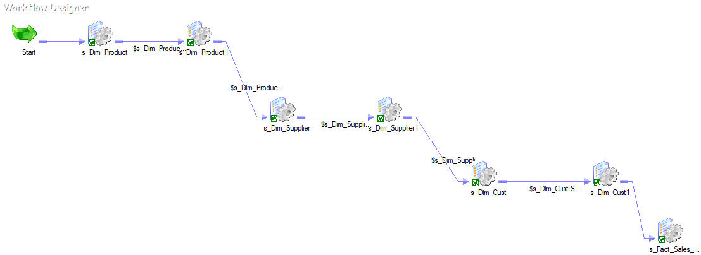
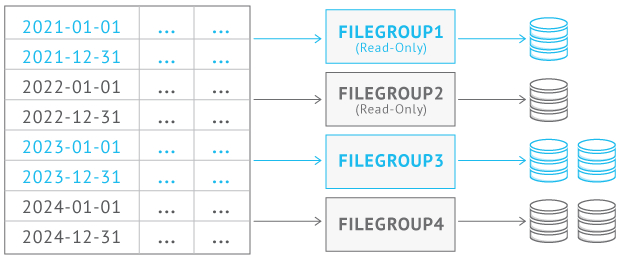

# 📊 Data Warehouse & ETL Project  **(Informatica PowerCenter + SQL Server)**

## 📌 Overview
This project demonstrates the design and implementation of an **enterprise-style Data Warehouse (DWH)** using **Informatica PowerCenter** for ETL and **SQL Server** as the data warehouse platform.

The project focuses on:
- Dimensional modeling (Fact & Dimensions)
- Incremental ETL processing
- SCD Type 2 handling
- Performance optimization (Partitioning & Columnstore)
- Analytics-ready views for BI consumption

---

## 🏗️ High-Level Architecture


---

## 🧱 Data Warehouse Design



### 🔹 Dimensional Model
- **Fact Table**
  - `fact_sales`
  - Grain: **One row per Order Item**
  - Measures: `quantity`, `unit_price`, `total_price`

- **Dimensions (SCD Type 2)**
  - `dim_customer` 
  - `dim_product`
  - `dim_supplier`
  - `dim_date`

> ⚠️ **Design Decision:**  
> This project intentionally uses **Business (Natural) Keys** instead of Surrogate Keys to simplify traceability and ETL troubleshooting, while preserving dimensional modeling principles.

---

## 🗂️ Dimension Mappings (Informatica)

Key features:
- SCD Type 2 implementation
- Historical tracking using `start_date` / `end_date`
- Change detection using hash comparison
- Insert & update paths handled via Router + Update Strategy


### 🧩 Customer Dimension


---

### 🧩 Product Dimension


---

### 🧩 Supplier Dimension


---

### 🧩 Date Dimension
> Date dimension generated using SQL script and includes:
> year, month, day, weekday, weekend flag, etc.

---

## 🧮 Fact Table ETL Design

### 🧩 Fact Sales Mapping


Key characteristics:
- Measures extracted from `Order` and `OrderItem`
- Incremental load based on `order_date`
- Lookup transformations used to bind fact records to dimensions
- Insert-only strategy (no truncation or rebuild)

---

## 🔄 Workflow Design


Workflow highlights:
- Uses **Workflow Variable** `$LAST_RUN_DATE`
- Supports incremental loading (CDC-style)
- Captures maximum processed date per run
- Ensures restartability and data consistency

---

## 🔁 Incremental Load Strategy

- Initial Run:
  - Full historical load
- Daily Runs:
  - Load only new records using:
    ```sql
    WHERE orderdate > $LAST_RUN_DATE
    ```
- Fact table is **append-only**
- No updates or deletes on historical facts

---

## 🚀 Performance Optimization

### 🔹 Partitioning
- Fact table partitioned by year using date column
- Improves query performance
- Enables partition elimination and future sliding-window maintenance



---

### 🔹 Indexing Strategy
- **Clustered Columnstore Index** on fact table
- Optimized for analytical workloads and aggregations
- No rowstore indexes on fact table (DWH best practice)
- Nonclustered indexes on dimension tables for filtering and joins

---

## 📈 Analytics & Reporting Views

The analytics layer exposes business-ready KPIs using SQL views:

- `vw_product_sales` – Product performance
- `vw_country_sales` – Country-level analysis
- `vw_monthly_sales` – Monthly trends
- `vw_customer_sales` – Customer insights
- `vw_yearly_growth` – Year-over-year growth
- `vw_top_products_per_country` – Best products by country
- `vw_sales_weekend_vs_weekday` – Weekend vs weekday comparison

---

## 🛠️ Technologies Used
- **ETL Tool:** Informatica PowerCenter
- **Database:** SQL Server
- **Modeling:** Dimensional Modeling (Star Schema)
- **Indexing:** Clustered Columnstore Index
- **Partitioning:** Range-based (Date)
- **Analytics:** SQL Views & Window Functions

---

## 🎯 Key Concepts Demonstrated
- Data Warehouse Architecture
- SCD Type 2 Handling
- Incremental Fact Loading
- Partitioning & Columnstore Optimization
- Analytical SQL & KPI Design
- Production-aware ETL Patterns

---

## 📌 Future Enhancements
- Sliding window partition maintenance
- Aggregate tables for heavy BI workloads
- Power BI dashboards

---

## 👤 Created by [Ahmed Rabie](https://www.linkedin.com/in/ahmedrabie4)
Data Engineer  
Interested in Data Warehousing, ETL, and Analytics Engineering
